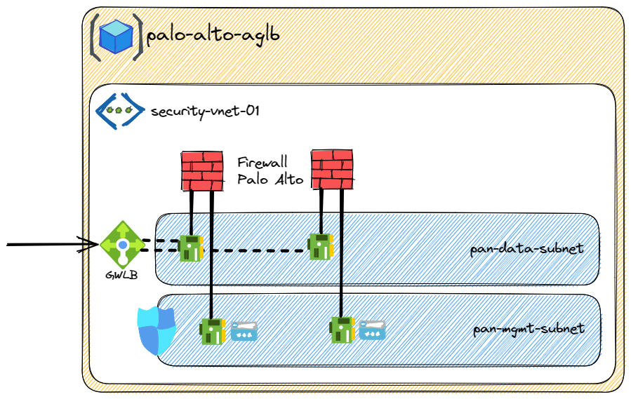
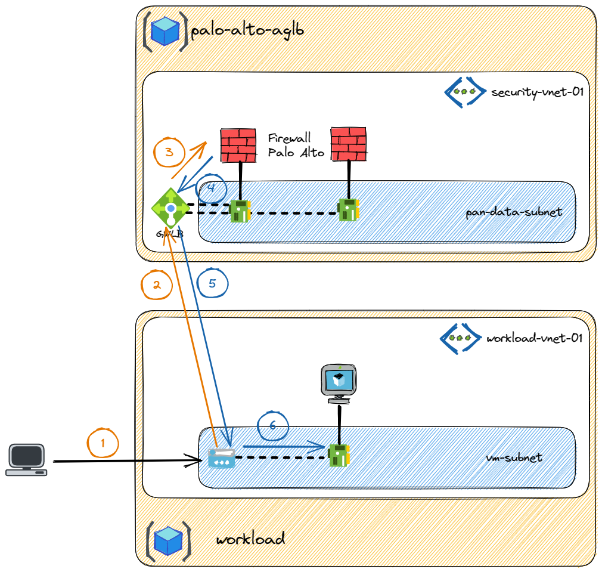
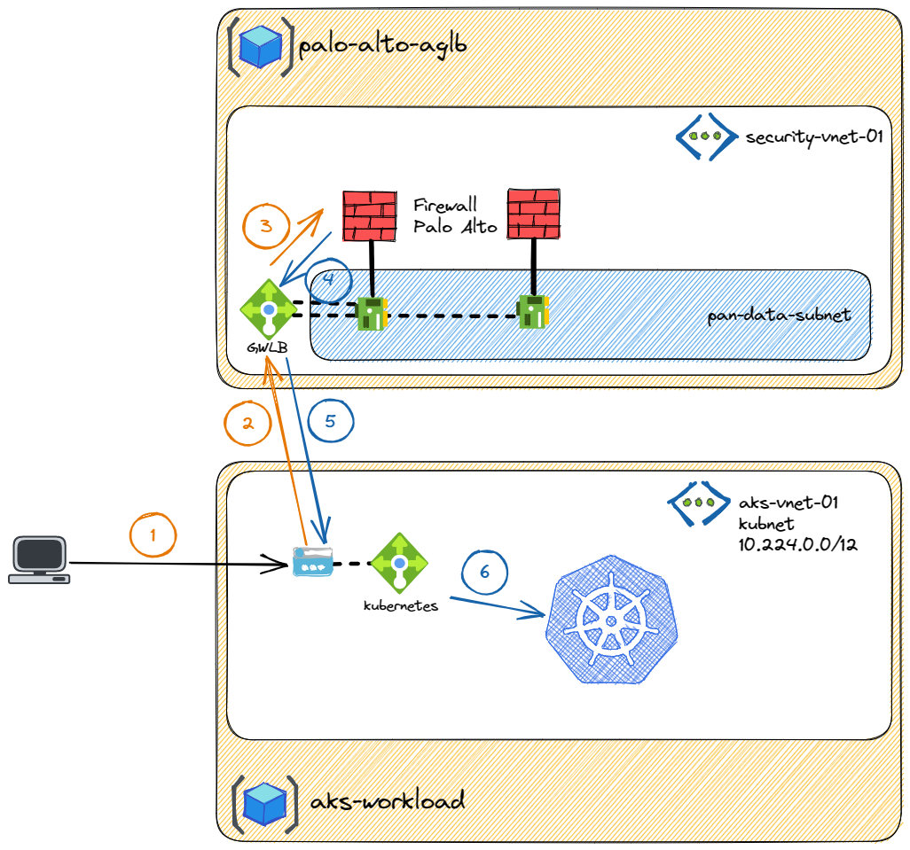

# Terraform Azure Gateway Load Balancer with Palo Alto VM firewall

## Overview
This project provides some Terraform scripts to deploy a ressource group with Azure Gateway Load Balancer configured to use Palo Alto VM firewall as backend.  

Gateway Load Balancer is a SKU of the Azure Load Balancer portfolio catered for high performance and high availability scenarios with third-party Network Virtual Appliances (NVAs). With the capabilities of Gateway Load Balancer, you can easily deploy, scale, and manage NVAs. Chaining a Gateway Load Balancer to your public endpoint only requires one selection.



# Implementation

## Requirements
You will need to install : 
* [Terraform](https://www.terraform.io/downloads.html) (tested with version v1.4.5)
* Terraform Providers (installed using command *terraform init*): 
  * azurerm (tested with version v3.52.0)
  * random (tested with version v3.5.1)
* Terraform modules: 
  * [Terraform Modules for Palo Alto Networks VM-Series on Azure Cloud](https://registry.terraform.io/modules/PaloAltoNetworks/vmseries-modules/azurerm/0.5.5)

## Quickstart
To deploy Azure Gateway Load Balancer you will have to customize variables.tf file : 
* allow_inbound_mgmt_ips variable list must contain public IPs that must be able to manage firewalls. You can get your public IP using the command : `curl ifconfig.me`
* other variables have some default values but can be customize according to your needs

````
> terraform init
> terraform plan
> terraform apply
````

````
Apply complete! Resources: 31 added, 0 changed, 0 destroyed.

Outputs:

paloalto_password = <sensitive>
paloalto_username = "panadmin"
paloalto_vmseries_01_dns = "https://fwvm-01-mgmt-xxx.westeurope.cloudapp.azure.com"
paloalto_vmseries_02_dns = "https://fwvm-02-mgmt-xxx.westeurope.cloudapp.azure.com"
````

If you let the script randomly generate the password you can retrieve the password using : `terraform output paloalto_password`.  
The firewall can take several minutes after the terraform is finished to complet the bootstrap and the initial configuration.

# Use cases
## Use case 1 : Protect VM with public IP

You can use Terraform scripts in folder workload/virtual-machine to provisionned the following infrastructure :  


Once the VM with public IP is provisonned, you will have to open required flows in Palo Alto firewalls. Let's open ssh to access your VM.

You will need your public IP : `curl ifconfig.me`  
and the public IP of the VM : `terraform output vm_publicip`

Open Palo Alto firewall console : "https://fwvm-01-mgmt-xxx.westeurope.cloudapp.azure.com"

Under POLICIES tab, add one rule before the Deny All rule: 


Commit config and do the same on the second firewall. Try to SSH your VM.
You can retrieve username and password to connect to the VM with : `terraform output vm_username && terraform output vm_password`

> **_NOTE:_**  in this example, both VNet security and workload are using the same IP range. As Azure Gateway Load Balancer and firewalls are using VXLAN to encapsulate the traffic, it's not an issue. Using this solution, you can manage security and IP overlapping. 

## Use case 2 : Protect public load balancer

You can use Terraform scripts in folder workload/load-balancer to provisionned the following infrastructure :


Exactly as for the VM, you will have to open required flows in Palo Alto firewalls. 

## Use case 3 : Protect public AKS

You can use Terraform scripts in folder workload/azure-kubernestes-service to provisionned the following infrastructure :


It can be interesting to protect your AKS with a firewall, in particular if you have deploy AKS using kubnet. 
Once AKS is provisioned you can deploy one application.

Once the application is running, you can go on the provisionned kubernetes load balancer to update the frontend IP configuration to add the Azure Gateway Load Balancer : 


[WIP] An Azure Policy can manage the automatic deployment of the configuration to avoid manual configuration on the kubernetes load balancer. 

# Useful links
- [Gateway Load Balancer Overview](https://learn.microsoft.com/en-us/azure/load-balancer/gateway-overview)
- [Deploy the VM-Series with the Azure Gateway Load Balancer - Palo Alto documentation](https://docs.paloaltonetworks.com/vm-series/11-0/vm-series-deployment/set-up-the-vm-series-firewall-on-azure/deploy-the-vm-series-firewall-with-the-azure-gwlb)
